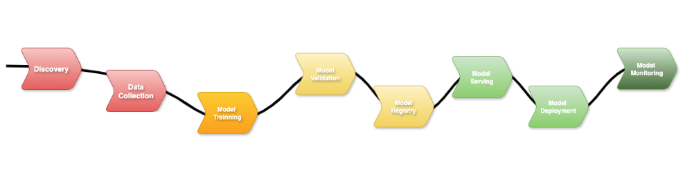

## How to get your ML/AI agent/LLM/agentic projects from development to production. 

In this blog, I will walk you through the workflow that will help you learn the principles and stages you will need to implement for your AI project's success.

I created an ML workflow diagram to help illustrate and address several key points during the project.

---

Here in this image, you can see the end-to-end flow that represents the various phases of your project. Let’s break down the steps from the image to get an ML workflow overview.

## 1. 💡 Discovery (Define Your Use Case and Architecture)

During this phase, you will gather information to define a use case, including where it will fit. 

- What is the problem are you solving?
- What is the benefit using AI to solve this problem? 
- What are the functional and non-functional requirements? 
- Which hardware, software, and infrastructure will you need?
- What is the AI policies or regulations need to be consider? 

Defining your use case is crucial to what you will need next during the implementation phase. 

If your use case is GenAI, it will need LLM, prompt design, fine-tune your domain model, and some cases, augmented generation (RAG) for updated answers. 

If you are defining a PredictAI like fraud detection, forecast systems or data/information classifications, you will need large historical data, statistical models, evaluation metrics, etc.

You can also define a hybrid use case, where you can use GenAI with an AI chatbot assisting with questions, but also PredictAI to estimate risks, recommendations for a career path or investments. 
	
The best thing to identify is to define what problem I am solving. Then you classify the type of value and output you want to generate. Do you want users to interact with natural language conversation, or to forecast, classify or score a behaviour or data set? Will the main goal be to get experience through thought questions and creative outputs, or to produce information to support decisions with probabilities and risks? Then create a well-defined/design on the main value the solution will bring to prevent misalign and wasted effort 
		
Let’s say, for example, you need to create an AI agent assistant for your team or a customer service AI to help answer questions and help with sales and production. You will need to scope your project, defining the sizing, hardware, infrastructure, security aspect, AI policies and regulations.

Are you developing using a cloud platform? What do the MLOps pipelines and lifecycle look like? Which tools to use to support the implementation and production phases?

These will also define the architecture and design of the project, which will vary from the type of AI project you want to create.

Nevertheless, whatever the project is defined during the first workflow phase will not change the rest of the ML workflow.

Once defined, the ML workflow’s subsequent phases flow naturally from this stage.

---

## 2. 📊 Data Collection (Getting your model)

Once the previous phase is defined, it’s time to collect the raw data structure or unstructured and where it will come from; it is a pre-model from HuggyFace, or you will do some web crawling to get data.
	
After that, you will prepare the data, clean it, normalise it, and fine-tune. This phase focuses is collecting and refining the data, making sure it’s both reliable and ethical to use. 

It’s common during this step to use a Python program or automation script to connect to HuggyFace and store this model in your own internal vector database. Then get data from your storage place for fine-tuning using the taxonomy strategy to generate syntactic data, which can go into more detail in another article.  

Basically, it’s to mix the existing model with your syntactic data to pre-train it, and the outcome is a new model which will save time during the training phase.

---

## 3. 🏋️‍♂️ Model Training

During this phase, your team will create the ML notebooks using various Python libraries to start training your AI model.

You can continue training your model by adding more relevant data. For example, in a fraud detection scenario, retraining the model with additional fraud and non-fraud cases helps improve its accuracy-generally, the more high-quality data the model has for training, the better it performs.

It could be something to enhance the model training it to add how to classify the risk levels, or training to be able to generate a report.

The Kubeflow model training can help during this stage by scheduling training jobs to request GPUs, TPUs, or other accelerators.

Takeaway: “High-quality, relevant data is the secret sauce to building an accurate AI model.”

Next, you need to test your model.

---

## 4. ✅ Model Validation
 

During the model validation phase, it’s important to ensure that only unseen data is used for evaluation. You should feed your model new training data (or labelled examples), not test data, when continuing training, to prevent data leakage and maintain the integrity of your validation results.

This process is when you evaluate your trained ML model will perform with unseen data, for example, in a fraud detection use case, you can use data that your model needs to confirm it’s a fraud and another that is not.

You want your model to generalises well, so it performs reliably on new data, producing valid predictions or meaningful outputs on new, unseen data rather than just memorising the training set.

This applies to both predictive AI, which makes forecasts or classifications, and generative AI, which creates text, images, or other outputs

---

## 5. 🗃️ Model Registry

Now, is time to register your model to create a version of it. This is important to keep traceability and the capability to train different model versions created from your previous steps.

It will be kept stored the exact training data, parameters and configurations used to produce that model. If an issue arises in production, you can reproduce the same results to debug and bug fix it.

Think here in the same way you create a software version for your back-end and front-end application, it’s the same approach and benefits.

Using the Kubeflow model registry, which is part of the Kubeflow ecosystem, is designed to store, version, and manage ML models in a structured, centralised way.

---

## 6. ⚙️ Model Server

In the MLOps workflow, this is the phase where you will configure a server that will load your model and expose it for inference.

This step up will define the infrastructure, environment where the model will run, more importantly, whether you will run in a single server utilising centralised resources for a large trained model or multiple servers, which is for smaller distributed trained models. 

Kubeflow model server is a component that can facilitate this configuration, which is cloud native, kubernetes friendly, easy to scale and production-ready. Also, as part of the Kubeflow ecosystem will integrate with Kubeflow Pipeline and Kubeflow Trainer.

---

## 7. 🚀 Model Deployment

After you have your model server ready, your model training is finished, is time to deploy your model and test it.

You will pull the specific version from your model registry, start your model serving framework such as Kubeflow Kserver, TensorFlow or TorchServer.

When you deploy your model, it will expose inference REST or gRPC endpoints for real-time execution.

Normally, you do that first in your dev environment, then move to UAT, PredProd and finally promote that model version running in the model server to Prod. If you are using a cloud platform, you can get all the benefits of having different project configurations in separate data centres to easily move your model from development to production.

---

## 8. 👁️ Model Monitoring (Keep an Eye on Your Model in Production)

You need observability to collect important metrics from your AI solutions, from GPU usage to identify performance degradation and other issues.

It’s recommended to configure alerts to notify your team of any model's unexpected behaviour or low quality outputs, as well as detecting bottlenecks, errors, allowing the team to reproduce the problems, retraining the model and fast redeploy a new version.  

The main benefit of monitoring is that it ensures deployed models remain accurate, reliable, and trustworthy over time, while providing actionable insights for maintenance, improvement, and governance.

A good example is to use [Grafana with NVIDIA](https://grafana.com/grafana/dashboards/14574-nvidia-gpu-metrics/) plugin to collect GPU metrics, which can help monitor your AI solution's health and decide if you need to increase or reduce the number of GPUs. 

Pro tip: Running your AI in the cloud makes it easy to scale up or down without downtime—your model will thank you!

---

## ⚠️ Considerations 

Now that we understand the ML workflow, you need an easy, repeatable, reusable way to execute the process flow over and over. You can’t expect that replating this process manually, playing step by step, will increase the chance of human error, misconfiguration, and accidentally using the wrong test data or steps.

Therefore, it’s strongly recommended to glue all steps using data science pipelines, applying MLOps principles.

In simple terms, MLOps is a combination of DevOps methodologies with Machine Learning to automate and manage to end lifecycle of ML models, bringing them from development to production.

I will show you in another article how to put into practice and implement MLOps for real.      

## 🧠 Final Thoughts

In this blog, we walked through the ML workflow, highlighting each of its essential phases.

Understanding and implementing a structured ML workflow is essential for the success of any AI project, whether it involves generative AI, predictive AI, or a hybrid approach. By following a clear end-to-end process. 

Which phase of the ML workflow do you find most challenging?

Try mapping your current AI project onto this workflow and see where you can improve.

**Hope this helps, see you next time**

>This page was last update at {{ "now" | date: "%Y-%m-%d %H:%M" }} 

